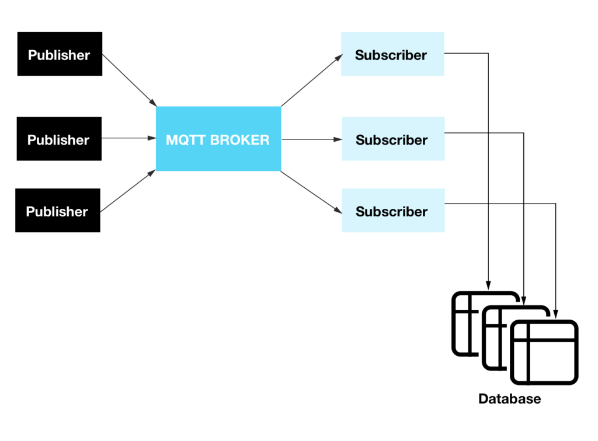

---
title:
- Virtualization 1 - Project
subtitle:
- MQTT
author:
- D. Walsken, M. Baba Mehdi, C. Voss
theme:
- CambridgeUS
colortheme:
- dove
---

# What is MQTT

## Problem 1

+ Big computation
+ Easily parallelizable
+ Can be run on multiple machines
+ No (easy) way to make the output thread coherent

## Problem 2

+ Many databases
	+ need the same data
	+ need data from remote location
+ Need to be up to date every time they connect

# What is MQTT

## Problem 3

+ High latency/unreliable network
+ Internet of things

# Solution

## MQTT:

+ **Message Queuing Telemetry Transport**
+ Publish/Subscribe Protocol
+ "The Core of MQTT is the **Topic**"
	+ Numerical units can publish to a topic
	+ Database client can subscribe to a topic

# MQTT

# MQTT
## Typical Setup
+ MQTT broker running in docker a container
+ Numerical client(s) generating numbers in a container
+ Database(s) with some glue code in the third container

# MQTT
## Project
+ Database: python running sqlite3
+ MQTT broker: Eclipse-Mosquitto
+ Numerical side: prime-generator using the "**Sieve of Eratosthenes**"

# Sources
## Image
+ https://crate.io/a/getting-started-cratedb-mqtt-endpoint/
# The End
__Thank you for your attention__

